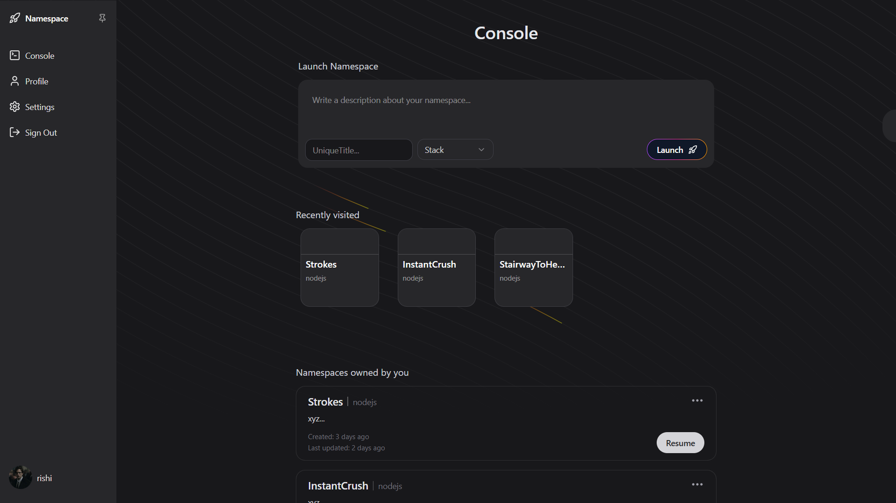
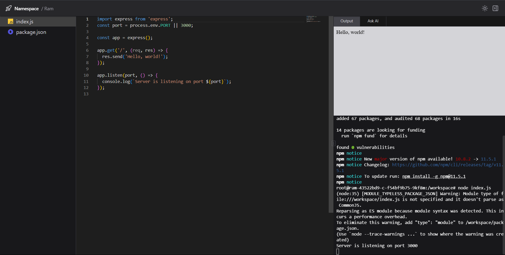
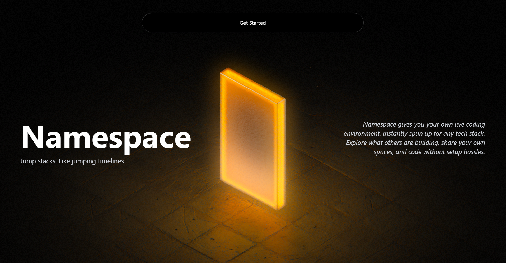
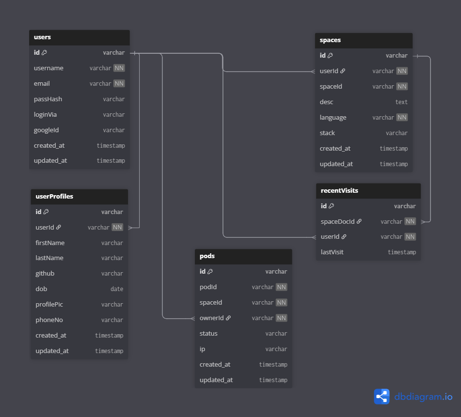
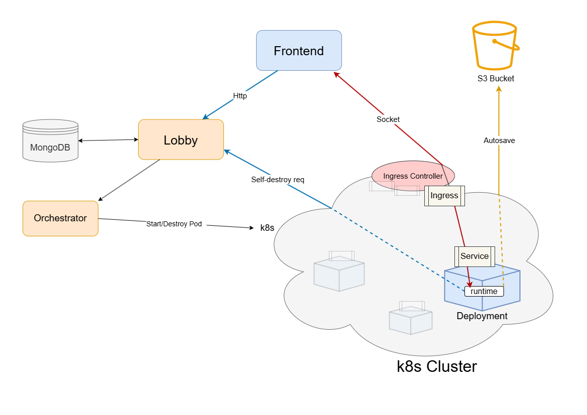
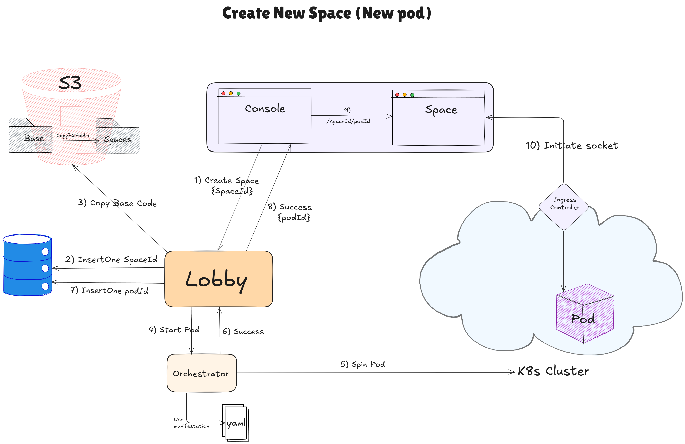
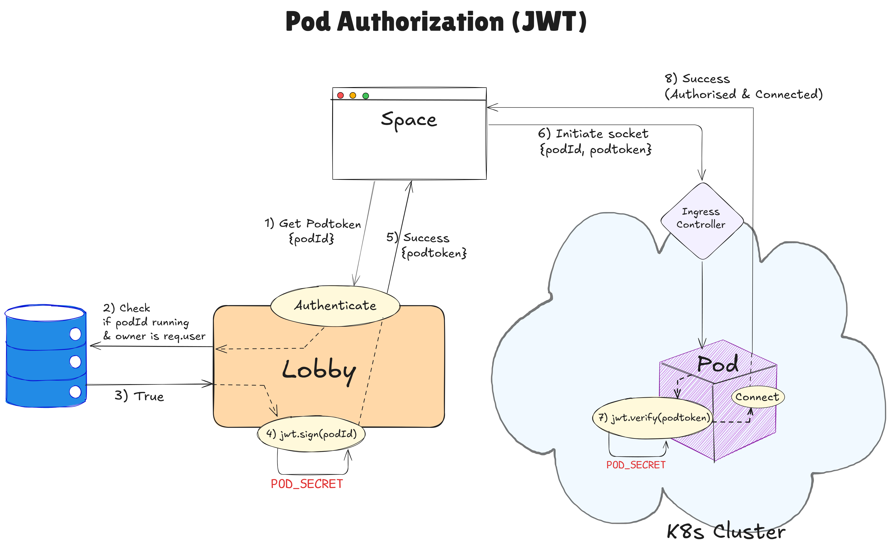
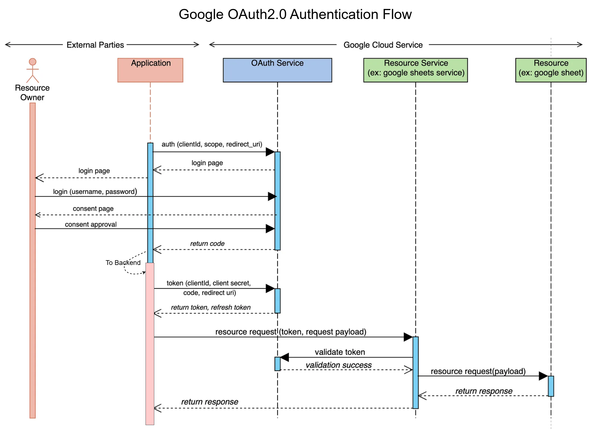

# Namespace

Namespace is a Kubernetes-powered online IDE that provides real-time terminal access and isolated full-stack environments to the developer.

## 📸 Screenshot

<!-- 

 -->
<p align="center">
  
  
  
</p>


## 📖 Table of Contents

- [About The Project](#about-the-project)
- [Tech Stack](#tech-stack)
- [Features](#features)
- [Architecture](#architecture)
  - [Database Schema](#database-schema)
  - [High-Level Architecture](#high-level-architecture)
  - [Major Workflows](#major-workflows)
- [Getting Started](#getting-started)
  - [Prerequisites](#prerequisites)
  - [Installation](#installation)
- [Usage](#usage)
- [Credits](#credits)

## About The Project

Namespace is a cloud-based, full-stack development environment that empowers users to write, run, and manage code entirely in the browser — no local setup required. Each user gets access to a secure, containerized Linux workspace (a Kubernetes pod), complete with a real-time terminal, an intelligent code editor, and persistent file storage.

Whether you're prototyping an idea, testing a script, or building full-stack applications, Namespace offers a lightweight yet powerful platform to code from anywhere.

##  Tech Stack

| 🧑‍🎨 Frontend                                      | 🛠️ Backend                                           |
|---------------------------------------------------|------------------------------------------------------|
| **React **                                      | **Node.js + Express.js 5**                          |
| **TypeScript**                                    | **TypeScript**                                      |
| **Vite** (build tool)                             | **MongoDB + Mongoose**                              |
| **Redux Toolkit** (state management)              | **JWT** (authentication)                            |
| **Tailwind CSS**                                  | **Bcrypt** (password hashing)                       |
| **shadcn** (UI library)        | **Socket.IO** (real-time terminal communication)    |
| **Framer Motion** (animations)                    | **node-pty** (pseudo-terminal backend)              |
| **Monaco Editor** (code editing)                  | **@kubernetes/client-node** (K8s integration)       |
| **Xterm.js** (interactive terminal)               | **AWS SDK (S3)** (storage/backup)                   |
| **Socket.IO Client** (WebSocket communication)    | **Docker** (container image)                |
| **Axios** (HTTP client)                           | **dotenv, cors, cookie-parser** (utilities)         |


##  Features

* **User Authentication:** Secure user registration and login using JWT and OAuth (Google Sign-In).
* **Cloud-based IDE:** Full-stack coding environment with code editor, terminal, and output preview.
* **Real-time Terminal:** Interactive bash shell using xterm.js and WebSockets powered by `node-pty`.
* **Persistent Storage:** Files are automatically backed up to S3-compatible storage (Backblaze B2).
* **Kubernetes Orchestration:** Each coding session runs in an isolated Kubernetes pod with dynamic provisioning.
* **Responsive & Resizable Layout:** Fully responsive layout with resizable editor, terminal, and right panel views.
* **Debounced Auto-Save:** Code changes are saved in real-time with debounce to reduce server load.
* **AI Integration (Planned):** Ask AI panel for contextual code assistance (feature placeholder).
* **Google OAuth Integration:** Easy sign-in via Google with secure session handling.
* **Theme Support:** Toggle between dark and light themes, persisted in local storage.

## Architecture

### Database Schema

This section illustrates the data model for the application. The Entity-Relationship Diagram (ERD) below shows the MongoDB collections, their fields, and the relationships between them.
<br>Created using [dbdiagram](https://dbdiagram.io/)

<p align="center">
    
</p>

### High-Level Architecture

Namespace uses a microservice architecture with Kubernetes at its core. The frontend connects to backend services (Lobby, Orchestrator) and real-time runtime pods via WebSocket and HTTP. Pods are managed dynamically through the orchestrator and autosave code to an S3 bucket. All runtimes run in isolated Kubernetes pods exposed via an Ingress controller.
<br>Created using [draw.io](https://draw.io/)

<p align="center">
  
</p>

### Major Workflows

The following diagrams illustrate key workflows in the system, including Pod Creation, Pod Authorization, and Google OAuth login. These were designed using [excalidraw](https://excalidraw.com/) (except Google OAuth) to visually represent how major components interact.

<p align="center">
  
  
  
</p>


##  Getting Started

To get a local copy of the project up and running, follow the steps below.

### Prerequisites

Ensure you have the following installed on your machine:

- [Node.js](https://nodejs.org/) (v18+ recommended)
- [Docker](https://www.docker.com/)
- [kubectl](https://kubernetes.io/docs/tasks/tools/) (Kubernetes CLI)
- [Minikube](https://minikube.sigs.k8s.io/docs/start/) (or a local Kubernetes cluster)
- [MongoDB](https://www.mongodb.com/cloud/atlas) (Atlas or local instance)

###  Installation

1. **Clone the repository:**

   ```sh
   git clone https://github.com/your-username/namespace.git
   cd namespace
   ```

2. **Install frontend dependencies:**

   ```sh
   cd frontend
   npm install
   ```

3. **Install backend dependencies:**

   There are 3 backend services — `lobby`, `orchestrator`, and `runtime`. Install dependencies for each:

   ```sh
   cd ../lobby
   npm install

   cd ../orchestrator
   npm install

   cd ../runtime
   npm install
   ```

4. **Set up environment variables:**

   Create `.env` files for each service.

   For `frontend/.env`:
   ```env
   VITE_SERVER_URI = 
   VITE_GOOGLE_OAUTH20_CLIENT_ID = 
   VITE_MINIKUBE_IP = your_k8s_cluster_ingress_controller_url
   ```

   For `backend/lobby/.env` (S3-compatible storage):
   ```env
   MONGO_URI =
   S3_BUCKET =
   AWS_BUCKET_ID =
   S3_ENDPOINT =
   S3_REGION =
   AWS_ACCESS_KEY_ID =
   AWS_SECRET_ACCESS_KEY =

   GOOGLE_OAUTH20_CLIENT_ID =
   GOOGLE_OAUTH20_CLIENT_SECRET = 
   GOOGLE_REDIRECT_URI =

   JWT_SECRET =
   JWT_POD_SECRET =

   CLIENT_URI =
   ORCHESTRATOR_URI=
   ```

   For `runtime/.env`:
   ```env
    Insert as Kubernetes Secret 
   ```
5. **Write a yaml file for Pod deployment**
   ```
   There is a service_demo.yaml in backend/orchestrator, you can edit it to your preferences along with inserting env secrets for runtime
   ```

6. **Docker image**
   ```
   In the service.yaml/service_demo.yaml file, either fetch the runtime image from this project's official Dockerhub registry or create your own image and fetch.
   ```

---

##  Usage

1. **Start Kubernetes (e.g., with Minikube):**

   ```sh
   minikube start
   ```

2. **Run backend services in dev mode:**

   ```sh
   cd backend/lobby && npm run dev
   cd backend/orchestrator && npm run dev
   ```

   Or run all backend services using Docker Compose:

   ```sh
   docker compose up --build
   ```

3. **Start the frontend app:**

   ```sh
   cd frontend
   npm run dev
   ```

   The app will be live at: [http://localhost:5173](http://localhost:5173)

---

##  Test Your Setup

- Open the app in your browser
- Sign up or log in using credentials or Google
- Create a coding environment and start coding in real-time inside a secure pod


## Credits

This project wouldn't be possible without the efforts of the following contributors:

| Contributor | GitHub Profile |
|-------------|----------------|
| **Ayush Tomar**  | [@ashonoit](https://github.com/ashonoit) |
| **Rishiraj Poswal**  | [@Rishi-Poswal](https://github.com/Rishi-Poswal) | 

---

